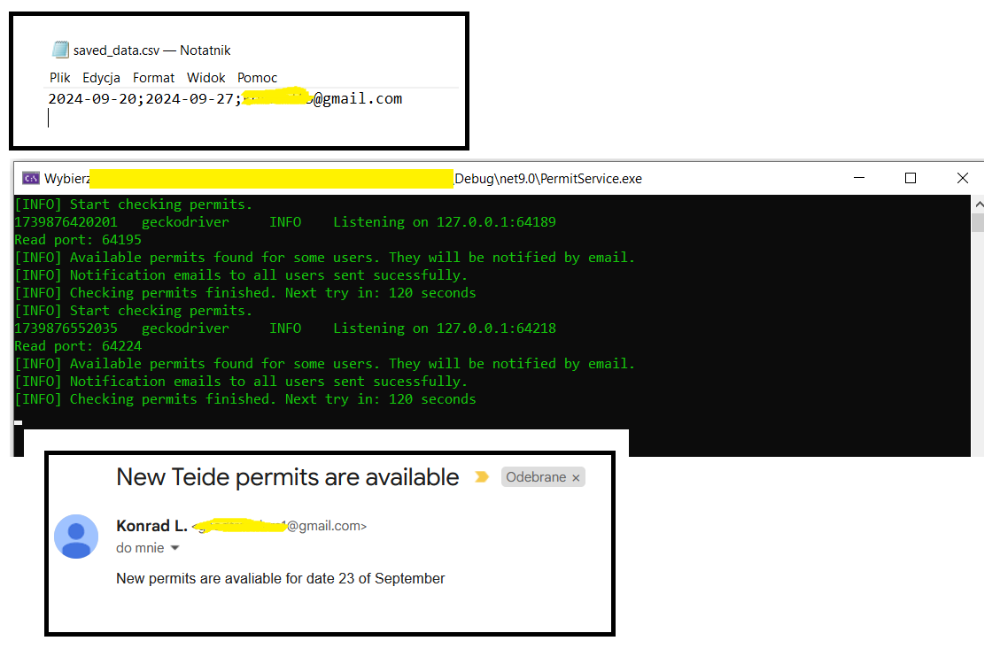

Volcano Teide Permit Notifier

Revelant techologies:
- C# (Net 9.0)
- Windows Service
- Selenium
- HtmlAgilityPack
- log4net
- NUnit / Moq

Description:
The Volcano Teide Permit Notifiier is a kind of bot which makes easier getting permits on volcano Teinde in Teneriffe especially when looking for permits on the last minute or in peek season. It is a Windows Service perioidilcally cheking permit availibility in given period of time and send email notifications if available permits found. In one time it can check permits and send notifications for multiple users. User email addres, start and end checking dates are taken from JSON file. Adding new user does not require restarting the service.    

Example of use:

